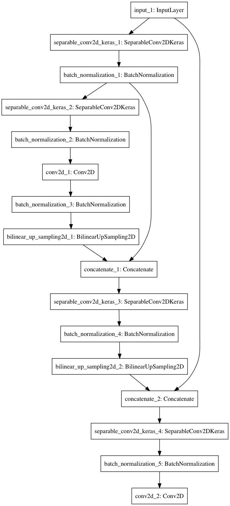

# Deep Learning Project

#### The write-up conveys the an understanding of the network architecture. 

## Introduction
This file describes the Follow Me project

In this project I build and train fully convolutional neural network, that makes segmentation.
This network can perform tracking of a target person (hero) in the simulation.

## Fully Convolutional Network (FCN)
FCN consists of 2 parts connected with 1x1 Convolution:
1. Encoder
2. Decoder

#### The student has a clear understanding and is able to identify the use of various techniques and concepts in network layers indicated by the write-up.
#### The student has a clear understanding of image manipulation in the context of the project indicated by the write-up.
### Encoder
Encoder extracts useful features from the images. This is just a set of convolutional layers.
Each layer of the encoder “squeezes” information form the input image.
In classical Convolutional network flatten the output by connecting it to the fully connected layer. Which leads to the spatial information loss.

### 1x1 Convolution
In order to keep spatial information we can use 1x1 convolution. It helped in reducing the dimensionality of the layer and avoid flattening of the output information. 

### Decoder
instead of using fully connected layers, we will use decoder.
It upsamples information from the encoder all the way to the original image size.

## Network Structure
| layers        | size           |
| --------------- |:-------------:|
| input layer     | 160x160x3  |
| encoder layer 1 | 80x80x64 |
| encoder layer 2 | 40x40x128 |
| 1 x 1 layer | 40x40x256 |
| decoder layer 1 | 80x80x128 |
| decoder layer 2 | 160x160x64 |

Some layers are concatenated directly (skipping). From Inputs 1 to  decoder level 2. From Encoder leyer 1 to decoder layer 1.

Here is Model screenshot:

#### The write-up conveys the student's understanding of the parameters chosen for the the neural network. 
## Parameters
1. Learning rate. *Learning rate is used to ensure convergence. With small learning rate NN can converge slowly, with high learning rate it might not converge (might overshoot the optimal point).* This should be relatively small as a starting choice, so I decide to start with 0.001.
2. Batch Size = 16. *Small batch size requires less memory but estimate of the gradient is less accurate.*
    1. I started with batch size of 64 on my CPU first, and in took couple hours to process 1 epoch. 
    2. Then I installed CUDA for my 780 GTX  on ubuntu (which was somewhat challenging I have to say). 
    3. It allowed me do use GPU with tensorflow
    4. But with GPU calculations batch size of 64 leads to memory error, I assume it can not fit to memory for my network structure.
    5. Then I lower my batch size to 16.
3. Epoch = 50. *How many times entire dataset will be fitted into the network. Bigger number usually leads to better results, but with big number there is a change of "overfitting"*. I decided to go with relatively big number for the start = 50.
4. Step_per_epoch = number of training examples / batch size
5. Validation steps = number of validation steps / batch size
6. Worker = 2 / Here I decide to stick with default value from the provided file. But since I have only 1 GPU this parameter is not should not be relevant anyway.

## Results 
I was able to get score of 40% from the first training of the network.
To improve NN results I can do following:
1. add more training examples.
2. add more layers to the NN
4. I can also use diferent NN types like SegNet

#### The student displays a solid understanding of the limitations to the neural network with the given data chosen for various follow-me scenarios which are conveyed in the write-up.

I think that current neural network type can easly track almost any other object like car, cat or a dog. But we only have sample data for the human, so in order to teach this type of network to follow other object we need proper training data.

